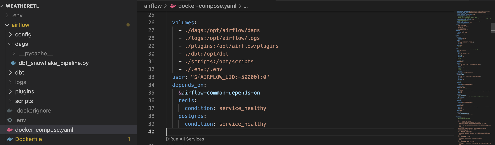
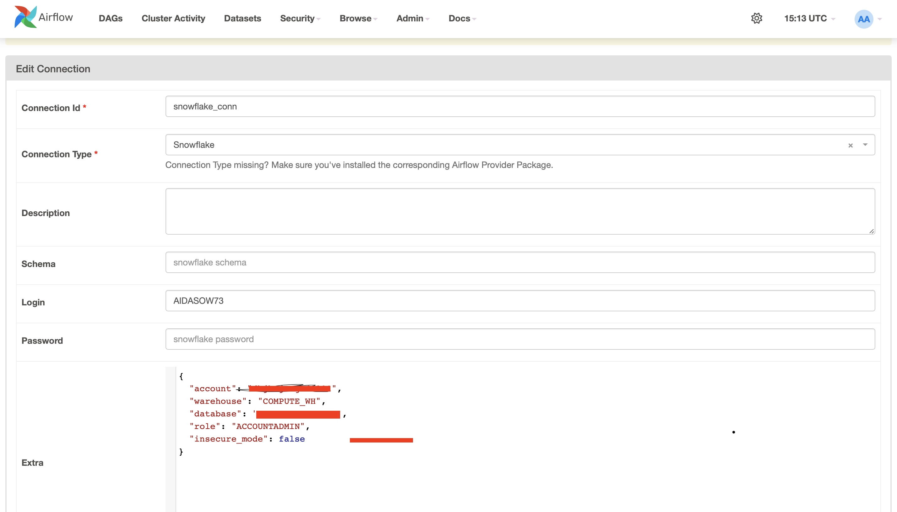
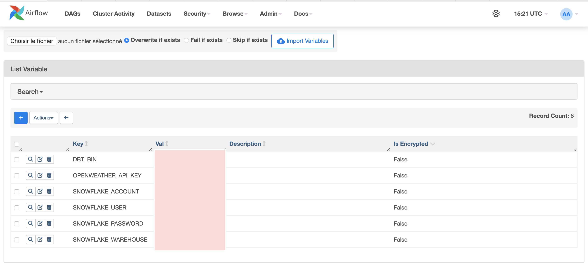
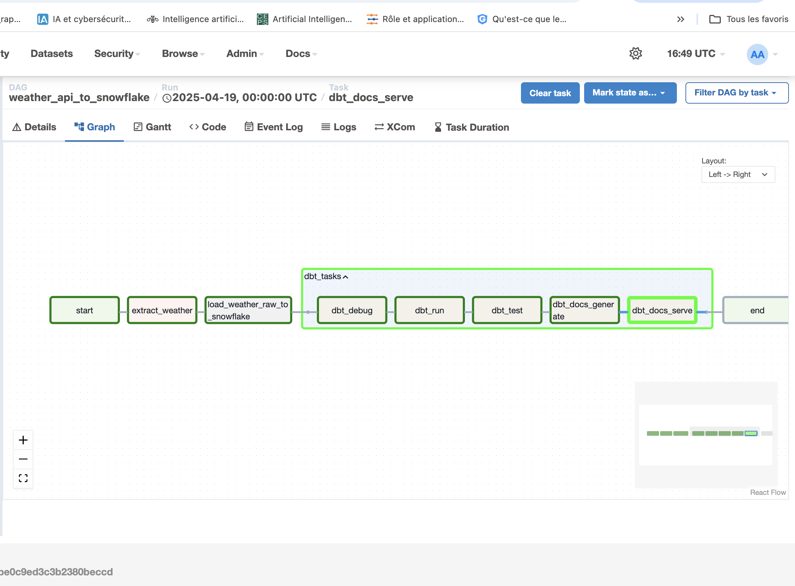
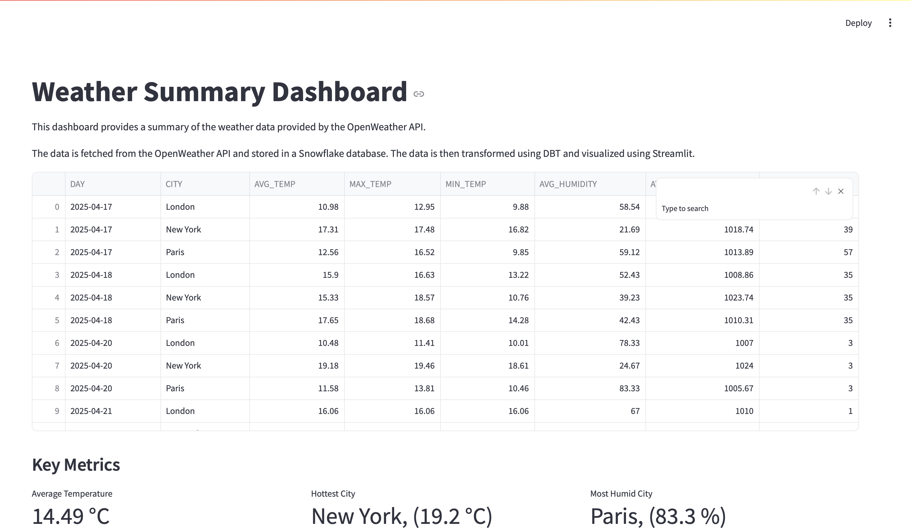
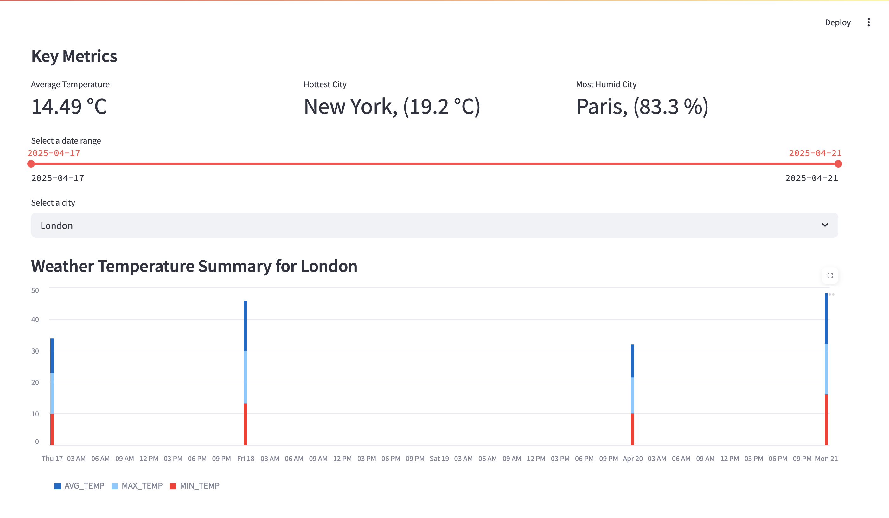
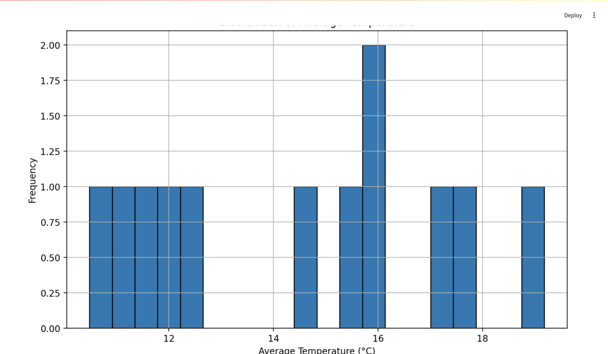

# ☁️ Weather ELT Pipeline with Airflow, DBT, Snowflake & Streamlit

## Overview

This project is a complete **end-to-end data pipeline** that collects weather data from the OpenWeather API, loads it into Snowflake, transforms it using DBT, and visualizes it with Streamlit.

It demonstrates how a **Data Engineer** can orchestrate data ingestion, transformation, and delivery of insights in a clean and modular way.

---

## 🔧 Tech Stack

| Tool         | Use Case                            |
|--------------|-------------------------------------|
| **Airflow**  | Pipeline orchestration              |
| **DBT**      | Data modeling & SQL transformations |
| **Snowflake**| Data warehouse                      |
| **Streamlit**| Dashboard & data visualization      |
| **Docker**   | Local dev environment               |

---

## Pipeline Architecture

1. **Airflow** triggers data ingestion every 24 hours
2. **PythonOperator** calls OpenWeather API
3. **SnowflakeOperator** loads raw data into `STAGING.WEATHER_RAW`
4. **DBT** transforms data into a summary table: `BASE.WEATHER_SUMMARY`
5. **Streamlit** visualizes the transformed data live from Snowflake

---

## 📂 Project Structure

```bash
    .

├── airflow
│   ├── config
│   ├── dags
│   │   └── __pycache__
│   ├── dbt
│   │   ├── logs
│   │   ├── macros
│   │   ├── models
│   │   └── target
│   ├── logs
│   │   ├── dag_id=tutorial
│   │   ├── dag_id=weather_api_to_snowflake
│   │   ├── dag_id=weather_dag
│   │   ├── dag_id=weather_pipeline
│   │   ├── dag_processor_manager
│   │   └── scheduler
│   ├── plugins
│   └── scripts
├── minio_data
│   └── weather-data-bucket
│       └── weather_data.csv
├── snapshots
└── weather_elt_streamlit
    └── streamlit
```
NB: We use airflow with docker by downloading the official docker-compose.yml from the documentation page:


Don't forget to add variables and snowflake connection in the Airflow UI:



---

## 📦 DBT Models

- **`stg_weather_raw.sql`**: staging layer, direct copy of `WEATHER_RAW`
- **`weather_summary.sql`**: daily aggregated stats (avg, max, min, etc.)
- **Macros**:
  - `to_fahrenheit`: convert Celsius → Fahrenheit

---

## 📊 Streamlit Dashboard

🔗 Live Demo: [Deployed on Streamlit Cloud](https://deprojecteltdocker-dbt-app-mas27v2zwyyynk9jyry2nj.streamlit.app)
The dashboard includes:
- KPI cards: hottest city, average temp, humidity
- Line chart of daily temps
- Temperature histogram
- Map of cities with weather metrics

<!-- [](https://youtu.be/vt5fpE0bzSY) -->
  
  

---

## 🚀 Getting Started (Local)

```bash
    git clone https://github.com/Aida73/de_project_elt_docker-dbt-snowflake.git
    cd weather-elt

    # Start Airflow (optional)
    docker-compose up --build

    # Launch Streamlit (if separate)
    cd weather_etl_streamlit
    docker build -t streamlit-weather .
    docker run --env-file .env -p 8501:8501 streamlit-weather
```

## 📌 Key Learnings

Building production-like ELT pipelines with Airflow + DBT
Modular SQL development and reusable macros
Cloud warehouse integration with Snowflake
Lightweight deployment of data apps via Streamlit
etc....
